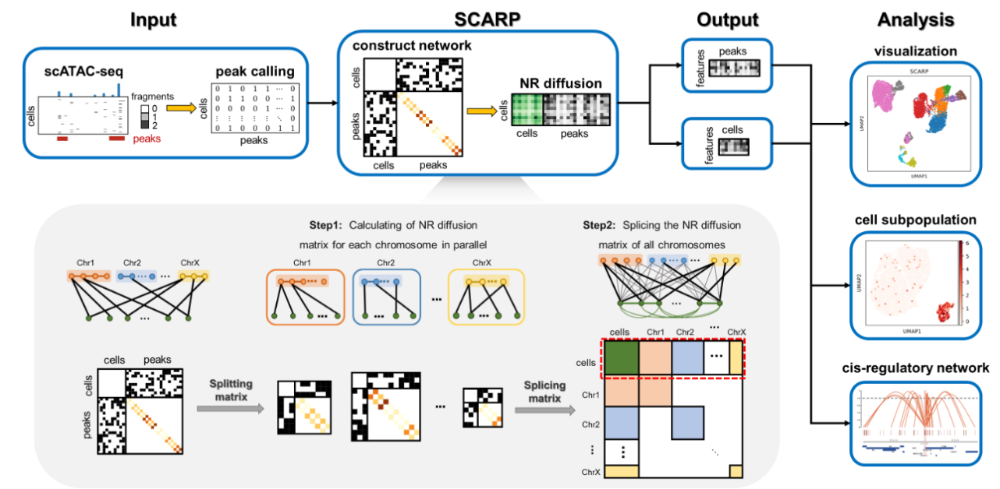

------------------------------------------------------------------------------------------------------
## SCARP (Single-Cell ATAC-seq Analysis via Network Refinement with Peaks Location Information)
------------------------------------------------------------------------------------------------------



## Authors:
yujiating@amss.ac.cn

lywu@amss.ac.cn


## Usage:
### <font color=#2D82B7>Step1: Data Preprocessing</font>
```python
data = sc.read_h5ad(data_file_name)
data = sort_peaks(data)
```

### <font color=#2D82B7>Step2: Run SCARP</font>
#### (1) parameter descriptions:
| parameter name | description                                          | type           | default |
| :------------- | :--------------------------------------------------- | :------------- | :------ |
| data           | input scATAC-seq data                                | AnnData object | None    |
| m              | diffusion intensity of NR                            | float          | 1.5     |
| merge_thre     | threshold to merge adjacent chromosomes              | int            | 3000    |
| beta           | control the extent to which prior edge weight decays | float          | 1.5     |
| return_shape   | shape of  return matrix                              | str            | 'CN'    |
| peak_loc       | adding prior weight or not                           | int            | True    |
| parallel       | parallel computing or not                            | int            | 0       |

  
#### (2) return:
| parameter name | description        | type   |
| :------------- | :----------------- | :----- |
| t              | running time       | float  |
| diffusion_mat  | NR diffused matrix | matrix |


#### (3) running example:
```python
t, diffusion_mat = SCARP(data = adata,
                         m = 1.5,
                         merge_thre = 3000,
                         beta = 5000,
                         return_shape = 'CN',
                         peak_loc = True,
                         parallel = 0)
```

### <font color=#2D82B7>Step3: Compute Embedding Dimension</font>
#### running example:
```python
k = std_plot(data = diffusion_mat,
             title = 'Kept component',
             max_k = 50,
             plot_std = True,
             save_file = 'Kept component.svg')
```


## Directory structure：
```
├─Exp1_Benchmark                         
│  │  README.md
│  │  S01_Data_Preprocessing.ipynb
│  │  S02_Run_SCARP.ipynb  
│  ├─figures    
│  ├─Processed data
│  ├─Raw data         
│  └─Results
│          
├─Exp2_Robustness
│  │  S01_Filter_peaks.ipynb
│  │  S02_Run_SCARP.ipynb
│  ├─Processed data
│  └─Results
│          
├─Exp3_SNARE_seq
│  │  README.md
│  │  S01_Signac_vignette.R
│  │  S02_Run_SCARP.ipynb
│  │  S03_Cells_clustering.R
│  │  SNARE.Rproj
│  ├─Processed data
│  ├─Raw data        
│  └─Results
│          
├─Exp4_SOX10_Knockdown
│  │  Exp4_SOX10_Knockdown.Rproj
│  │  README.md
│  │  S01_Run_SCARP.ipynb
│  │  S02_Peak annotation.R
│  │  S03_Computing_coaccessible_peaks.ipynb
│  │  S04_Gene_Enrichment.R
│  │  S05_Survival_analysis.R
│  ├─figures    
│  ├─Processed data    
│  ├─Results        
│  ├─Survival result   
│  └─TCGA
│          
├─Exp5_10X_Multiome
│  │  help_func.py
│  │  README.md
│  │  S01_Data_Preprocessing.ipynb
│  │  S02_Run_SCARP_CD4naive.ipynb
│  │  S03_PCHIC_Enhancer_CD4naive.ipynb
│  │  S04_Chip_Seq.ipynb
│  │  S05_Differential_Analysis.ipynb 
│  ├─figures   
│  ├─Processed data  
│  ├─Raw data            
│  └─Results
│          
└─Scarp
    │  data_preprocessing.py
    │  downstream.py
    │  SCARP_help_func.py
    └─

```


## Reproduce results
1. Follow instructions in each subfile to prepare the necessary data.
2. Run the code step by step.